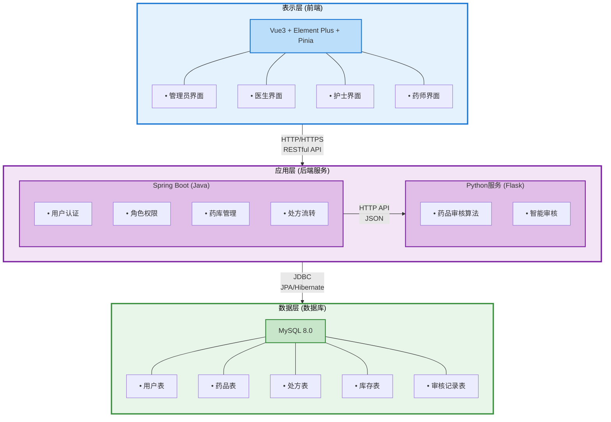

# 1 概述

## 1.1 系统概述

医院药房智能管理系统（Hospital Pharmacy Intelligent Management System，HPIMS）是一个基于前后端分离架构的现代化医药库存和处方管理平台。系统旨在通过信息化手段提高医院药房的管理效率，规范药品管理流程，保障药品使用的安全性，为医院药房提供智能化、自动化的管理解决方案。

### 1.1.1 系统背景

随着医疗信息化的快速发展，传统的医院药房管理方式已难以满足现代医疗服务的需求。传统管理方式存在以下问题：

1. **药品信息管理不规范**：药品信息记录分散，难以统一管理，容易出现信息不一致的情况。
2. **库存管理效率低下**：库存盘点依赖人工操作，容易出现差错，且无法实时掌握库存情况。
3. **处方审核流程繁琐**：处方审核完全依赖人工，审核效率低，且容易出现审核疏漏。
4. **缺乏数据统计分析**：无法对药品使用情况、审核结果等进行有效的统计分析。

为解决上述问题，开发本系统以实现药房管理的数字化转型。

### 1.1.2 系统目标

本系统的主要目标包括：

1. **提高管理效率**：通过信息化手段实现药品信息的统一管理，提高药品入库、出库、库存查询等操作的效率。
2. **保障用药安全**：通过自动审核和人工审核相结合的方式，对处方进行严格审核，确保用药的合理性和安全性。
3. **规范业务流程**：建立规范的处方录入、审核、发药流程，确保每个环节都有记录可追溯。
4. **支持决策分析**：提供药品使用统计、审核结果分析等功能，为医院管理决策提供数据支持。
5. **实现角色权限控制**：根据不同的用户角色（管理员、医生、护士、药师）提供相应的功能权限，确保系统安全性。

### 1.1.3 系统特点

本系统具有以下特点：

1. **前后端分离架构**：采用Spring Boot作为后端服务框架，Vue3作为前端框架，实现前后端完全分离，提高系统的可维护性和可扩展性。
2. **多角色权限管理**：支持管理员、医生、护士、药师四种角色，每种角色具有不同的功能权限。
3. **智能处方审核**：集成Python审核服务，实现处方的自动审核，提高审核效率和准确性。
4. **实时库存管理**：实现药品入库、出库的实时记录和库存自动更新，支持库存预警功能。
5. **完整的审核流程**：支持自动审核和人工审核相结合，审核结果可追溯。
6. **友好的用户界面**：采用Element Plus组件库，提供美观、易用的用户界面。

## 1.2 术语和缩略语

本文档中使用的术语和缩略语定义如下：

| 术语/缩略语 | 英文全称 | 中文释义 |
|------------|---------|---------|
| HPIMS | Hospital Pharmacy Intelligent Management System | 医院药房智能管理系统 |
| API | Application Programming Interface | 应用程序编程接口 |
| REST | Representational State Transfer | 表述性状态传递 |
| CRUD | Create, Read, Update, Delete | 创建、读取、更新、删除 |
| JWT | JSON Web Token | JSON Web令牌 |
| ORM | Object-Relational Mapping | 对象关系映射 |
| JPA | Java Persistence API | Java持久化API |
| MVC | Model-View-Controller | 模型-视图-控制器 |
| SPA | Single Page Application | 单页应用 |
| RBAC | Role-Based Access Control | 基于角色的访问控制 |
| HTTP | HyperText Transfer Protocol | 超文本传输协议 |
| HTTPS | HTTP Secure | 安全超文本传输协议 |
| SQL | Structured Query Language | 结构化查询语言 |
| ER图 | Entity-Relationship Diagram | 实体关系图 |
| DTO | Data Transfer Object | 数据传输对象 |
| UI | User Interface | 用户界面 |
| UX | User Experience | 用户体验 |
| IDE | Integrated Development Environment | 集成开发环境 |
| JSON | JavaScript Object Notation | JavaScript对象表示法 |
| XML | eXtensible Markup Language | 可扩展标记语言 |
| B/S | Browser/Server | 浏览器/服务器架构 |
| C/S | Client/Server | 客户端/服务器架构 |

**业务术语：**

| 术语 | 说明 |
|-----|------|
| 处方 | 医生为患者开具的药品使用凭证，包含患者信息、药品明细、用法用量等 |
| 处方明细 | 处方中具体包含的药品信息，包括药品名称、数量、用法用量、频次、天数等 |
| 审核 | 对处方进行合理性检查的过程，包括自动审核和人工审核两种方式 |
| 自动审核 | 系统通过Python审核服务自动对处方进行审核，检查药品适应症、禁忌症、相互作用等 |
| 人工审核 | 药师对处方进行人工审核，结合自动审核结果做出最终审核决定 |
| 发药 | 根据已通过审核的处方，从药房库存中取出药品并发放给患者的过程 |
| 入库 | 将新采购的药品加入药房库存的过程 |
| 出库 | 从药房库存中取出药品的过程，包括发药、盘亏、过期等原因 |
| 库存预警 | 当药品库存数量低于最低库存阈值时，系统发出的提醒 |
| 批号 | 药品生产批次编号，用于药品溯源管理 |
| 适应症 | 药品可以治疗或缓解的疾病或症状 |
| 禁忌症 | 禁止使用该药品的情况或疾病 |
| 药物相互作用 | 同时使用多种药物时，药物之间可能产生的相互影响 |
| 审核评分 | 审核服务对处方合理性的评分，通常为0-100分 |
| 审核结果 | 审核的最终结论，包括通过、警告、拒绝三种状态 |

## 1.3 开发环境

### 1.3.1 硬件环境

- **服务器**：CPU 2核以上，内存 4GB以上，硬盘 20GB以上
- **客户端**：支持主流浏览器的PC端或移动端设备

### 1.3.2 软件环境

#### 后端开发环境

- **操作系统**：Windows 10/11、Linux、macOS
- **Java版本**：JDK 21或更高版本
- **构建工具**：Maven 3.6+
- **开发工具**：IntelliJ IDEA 2023或Eclipse
- **数据库**：MySQL 8.0
- **数据库管理工具**：MySQL Workbench、Navicat等

#### 前端开发环境

- **Node.js版本**：Node.js 18.0或更高版本
- **包管理工具**：npm 9.0+ 或 yarn 1.22+
- **开发工具**：Visual Studio Code、WebStorm等
- **浏览器**：Chrome、Firefox、Edge、Safari等主流浏览器

#### Python服务环境

- **Python版本**：Python 3.8或更高版本
- **Web框架**：Flask 2.0+
- **依赖管理**：pip、requirements.txt

### 1.3.3 技术栈

#### 后端技术栈

- **框架**：Spring Boot 2.7.x
- **ORM**：Spring Data JPA（基于Hibernate）
- **安全框架**：Spring Security + JWT（JSON Web Token）
- **数据库**：MySQL 8.0
- **API文档**：Swagger/OpenAPI 3.0
- **构建工具**：Maven
- **日志框架**：Logback
- **数据验证**：Hibernate Validator

#### 前端技术栈

- **框架**：Vue 3.x（Composition API）
- **构建工具**：Vite 4.x
- **UI组件库**：Element Plus 2.x
- **状态管理**：Pinia 2.x
- **路由管理**：Vue Router 4.x
- **HTTP客户端**：Axios 1.x
- **图表库**：ECharts 5.x（用于数据可视化）

#### Python服务技术栈

- **Web框架**：Flask 2.x
- **数据处理**：pandas、numpy
- **算法库**：scikit-learn（可选）
- **HTTP客户端**：requests

#### 开发工具

- **版本控制**：Git
- **建模工具**：StarUML、Draw.io、PlantUML
- **API测试工具**：Postman、Apifox
- **数据库设计工具**：MySQL Workbench

## 1.4 系统功能概述

系统主要包含以下功能模块：

### 1.4.1 用户管理模块

- **用户认证**：支持用户登录、登出功能，采用JWT进行身份认证。
- **用户信息管理**：管理员可以对用户进行增删改查操作，包括用户名、密码、真实姓名、部门、职工号、职称等信息。
- **角色权限管理**：系统支持四种角色（管理员、医生、护士、药师），每种角色具有不同的功能权限。

### 1.4.2 药品管理模块

- **药品信息管理**：支持药品信息的增删改查操作，包括药品名称、通用名、规格、厂家、价格、适应症、禁忌症、药物相互作用等信息。
- **药品查询与搜索**：支持按药品名称、分类等条件进行查询和搜索。
- **药品分类管理**：支持药品分类的维护和查询。

### 1.4.3 库存管理模块

- **药品入库管理**：支持药品入库操作，记录入库数量、批号、供应商、入库日期等信息，并自动更新库存。
- **药品出库管理**：支持药品出库操作，记录出库数量、出库原因、出库日期等信息，并自动更新库存。
- **库存查询**：支持按药品查询当前库存数量，支持库存预警功能。
- **库存统计**：支持库存统计和报表生成。

### 1.4.4 处方管理模块

- **处方录入**：医生可以录入处方信息，包括患者信息（姓名、年龄、性别、症状、诊断、过敏史等）、药品明细（药品名称、数量、用法用量、频次、天数）等。
- **处方查询**：支持按处方编号、患者姓名、医生姓名、状态等条件查询处方。
- **处方审核**：支持自动审核和人工审核两种方式。自动审核通过Python审核服务进行，人工审核由药师完成。
- **处方发药**：护士可以根据已通过审核的处方进行发药操作，系统自动扣减库存并生成出库记录。
- **处方状态管理**：处方状态包括未审核、审核中、已通过、已拒绝、已发药、已取消等。

### 1.4.5 审核记录管理模块

- **审核记录查询**：支持查询处方的审核历史记录，包括自动审核和人工审核记录。
- **审核结果展示**：展示审核结果（通过/警告/拒绝）、审核评分、发现的问题、建议等信息。
- **审核统计分析**：支持审核结果的统计分析，包括审核通过率、常见问题统计等。

### 1.4.6 数据统计模块

- **药品使用统计**：统计药品的使用情况，包括使用量、使用频率等。
- **库存预警**：对低库存药品进行预警提示。
- **审核统计**：统计审核结果、审核通过率等数据。
- **数据可视化**：通过图表展示统计数据，便于分析和决策。

## 1.5 系统架构概述

系统采用前后端分离的三层架构设计，包括表示层（前端）、应用层（后端服务）、数据层（数据库）。

### 1.5.1 整体架构

### 1.5.2 技术架构

- **前端架构**：采用Vue3的单页应用（SPA）架构，通过Vue Router实现页面路由，通过Pinia进行状态管理，通过Axios与后端API进行数据交互。
- **后端架构**：采用Spring Boot的MVC架构，包括Controller层（处理HTTP请求）、Service层（业务逻辑处理）、Repository层（数据访问）、Model层（实体类）。
- **数据库架构**：采用MySQL关系型数据库，通过JPA进行ORM映射，实现对象关系映射。

### 1.5.3 安全架构

- **身份认证**：采用JWT（JSON Web Token）进行无状态身份认证，用户登录后获得Token，后续请求携带Token进行身份验证。
- **权限控制**：基于Spring Security实现基于角色的访问控制（RBAC），不同角色具有不同的功能权限。
- **数据安全**：用户密码采用BCrypt加密存储，API接口采用HTTPS协议传输，确保数据传输安全。

