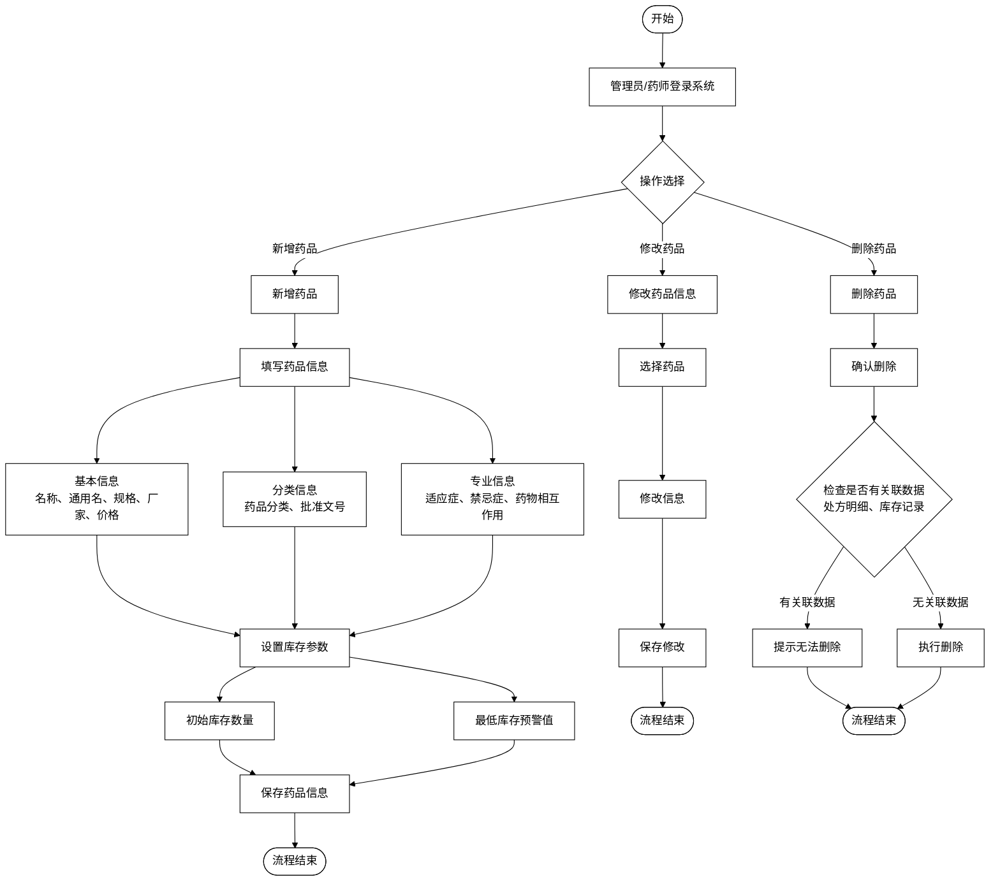
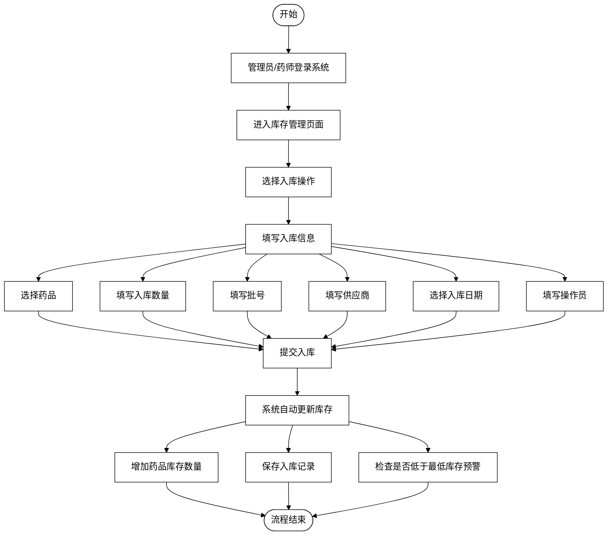
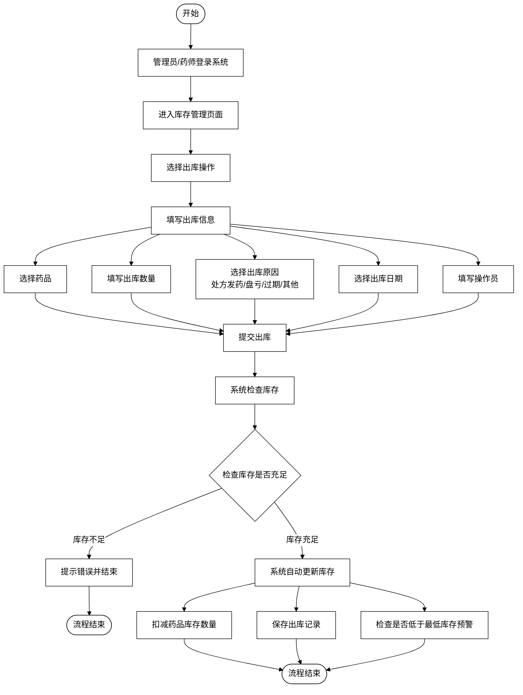
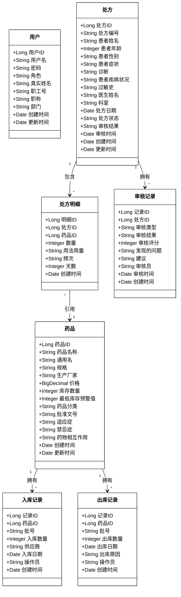

****# 2 系统分析

## 2.1 用户特征分析

本系统的用户主要分为四类：管理员、医生、护士和药师。每类用户具有不同的职责和使用场景，系统根据用户角色提供相应的功能权限。

### 2.1.1 管理员（Administrator）

**用户特征：**
- 具有系统的最高权限，负责系统的整体管理和维护
- 通常是医院信息科或药房管理人员
- 需要具备一定的计算机操作能力和系统管理知识
- 对系统的所有功能模块都有访问权限

**主要职责：**
- 用户账号的管理（创建、修改、删除用户账号）
- 药品信息的管理（新增、修改、删除药品信息）
- 库存管理的监督（查看入库、出库记录，监控库存状态）
- 处方管理的监督（查看所有处方，监督处方审核流程）
- 审核记录的查看和统计分析
- 系统参数的配置和维护

**重要程度：** ⭐⭐⭐⭐⭐（非常重要）

**相关需求：**
- 用户管理需求
- 药品管理需求
- 库存管理需求
- 系统统计需求
- 系统配置需求

### 2.1.2 医生（Doctor）

**用户特征：**
- 负责为患者开具处方
- 需要了解药品的基本信息和用法用量
- 需要记录患者的症状、诊断等信息
- 计算机操作能力要求中等

**主要职责：**
- 处方录入（录入患者信息、选择药品、填写用法用量等）
- 查看自己开具的处方（查看处方状态、审核结果等）
- 修改或取消未审核的处方
- 查看药品信息（药品名称、规格、价格等基本信息和适应症、禁忌症等详细信息）

**重要程度：** ⭐⭐⭐⭐⭐（非常重要）

**相关需求：**
- 处方录入需求
- 处方查询需求
- 药品信息查询需求

### 2.1.3 护士（Nurse）

**用户特征：**
- 负责根据已审核通过的处方进行发药操作
- 需要了解处方的基本信息和发药流程
- 计算机操作能力要求中等

**主要职责：**
- 查看待发药的处方列表
- 查看处方详情和审核结果
- 执行发药操作（确认发药后系统自动扣减库存）
- 查看已发药的处方记录

**重要程度：** ⭐⭐⭐⭐（重要）

**相关需求：**
- 处方查询需求（仅查看已通过审核的处方）
- 发药操作需求

### 2.1.4 药师（Pharmacist）

**用户特征：**
- 负责处方的审核和药品库存管理
- 需要具备专业的药学知识，能够判断处方的合理性
- 需要了解药品的适应症、禁忌症、相互作用等信息
- 计算机操作能力要求中等

**主要职责：**
- 处方审核（查看自动审核结果，进行人工审核，决定通过或拒绝）
- 库存管理（药品入库、出库操作，库存查询）
- 查看审核记录和审核历史
- 查看药品信息和库存状态

**重要程度：** ⭐⭐⭐⭐⭐（非常重要）

**相关需求：**
- 处方审核需求
- 库存管理需求
- 审核记录查询需求

### 2.1.5 用户类重要性总结

**重要用户类（核心用户）：**
1. **管理员** - 系统管理和维护的核心用户
2. **医生** - 处方录入的核心用户，系统的主要数据来源
3. **药师** - 处方审核和库存管理的核心用户

**一般用户类（辅助用户）：**
4. **护士** - 发药操作的用户，功能相对简单但不可或缺

## 2.2 业务流程分析

### 2.2.1 处方管理业务流程

处方管理是本系统的核心业务流程，包括处方录入、审核、发药三个主要环节。

**流程图说明：**

```mermaid
%%{init: {'theme':'base', 'themeVariables': {'primaryColor':'#ffffff', 'primaryTextColor':'#000000', 'primaryBorderColor':'#000000', 'lineColor':'#000000', 'secondaryColor':'#ffffff', 'tertiaryColor':'#ffffff', 'noteBkgColor':'#ffffff', 'noteTextColor':'#000000', 'noteBorderColor':'#000000', 'actorBorder':'#000000', 'actorBkg':'#ffffff', 'actorTextColor':'#000000', 'actorLineColor':'#000000', 'signalColor':'#000000', 'signalTextColor':'#000000', 'labelBoxBkgColor':'#ffffff', 'labelBoxBorderColor':'#000000', 'labelTextColor':'#000000', 'loopTextColor':'#000000', 'activationBorderColor':'#000000', 'activationBkgColor':'#ffffff', 'sequenceNumberColor':'#000000', 'sectionBkgColor':'#ffffff', 'sectionBkgColor2':'#ffffff', 'excludeBkgColor':'#ffffff', 'excludeTextColor':'#000000', 'cScale0':'#ffffff', 'cScale1':'#ffffff', 'cScale2':'#ffffff', 'mainBkgColor':'#ffffff', 'secondBkgColor':'#ffffff', 'tertiaryBkgColor':'#ffffff'}}}%%
flowchart TD
    Start([开始]) --> Login[医生登录系统]
    Login --> Input[录入处方信息]
    Input --> Input1[填写患者信息<br/>姓名、年龄、性别、症状、诊断、过敏史]
    Input --> Input2[添加药品明细<br/>选择药品、数量、用法用量、频次、天数]
    Input1 --> Submit[提交处方]
    Input2 --> Submit
    Submit --> GenNum[系统自动生成处方号]
    GenNum --> AutoAudit[系统自动触发审核]
    AutoAudit --> Check1[调用Python审核服务]
    Check1 --> Check2[检查药品适应症与患者病症匹配]
    Check2 --> Check3[检查药品禁忌症]
    Check3 --> Check4[检查药物相互作用]
    Check4 --> Check5[检查用量合理性]
    Check5 --> GenResult[生成审核评分和结果<br/>通过/警告/拒绝]
    GenResult --> SaveAuto[保存自动审核记录]
    SaveAuto --> UpdateStatus1[处方状态：未审核 → 审核中]
    UpdateStatus1 --> ViewPres[药师查看待审核处方]
    ViewPres --> ManualAudit[药师进行人工审核]
    ManualAudit --> ViewAuto[查看自动审核结果]
    ManualAudit --> ViewDetail[查看处方详情]
    ViewAuto --> Judge[综合判断]
    ViewDetail --> Judge
    Judge --> Decision[做出审核决定<br/>通过/警告/拒绝]
    Decision --> SaveManual[保存人工审核记录]
    SaveManual --> CheckResult{审核结果判断}
    CheckResult -->|通过| StatusPass[处方状态：已通过]
    CheckResult -->|警告| StatusWarn[处方状态：已通过带警告]
    CheckResult -->|拒绝| StatusReject[处方状态：已拒绝]
    StatusPass --> ViewDispense[护士查看待发药处方]
    StatusWarn --> ViewDispense
    ViewDispense --> Dispense[执行发药操作]
    Dispense --> CheckStock[系统检查库存是否充足]
    CheckStock -->|充足| ReduceStock[扣减库存]
    CheckStock -->|不足| Error1[提示库存不足]
    ReduceStock --> GenOut[生成出库记录]
    GenOut --> UpdateStatus2[更新处方状态：已发药]
    UpdateStatus2 --> End1([流程结束])
    Error1 --> End1
    StatusReject --> ViewReject[医生查看被拒绝的处方]
    ViewReject --> Modify[医生修改处方或取消处方]
    Modify --> End2([流程结束或重新提交审核])
```

**业务流程说明：**

1. **处方录入阶段**：
   - 医生登录系统后，进入处方管理页面
   - 填写患者基本信息（姓名、年龄、性别、症状、诊断、过敏史等）
   - 添加处方明细，为每个药品填写数量、用法用量、频次、天数等信息
   - 提交处方，系统自动生成唯一的处方编号

2. **自动审核阶段**：
   - 处方提交后，系统自动调用Python审核服务
   - 审核服务根据药品适应症与患者病症进行匹配检查
   - 检查药品禁忌症、药物相互作用、用量合理性等
   - 生成审核评分（0-100分）和审核结果（通过/警告/拒绝）
   - 将自动审核记录保存到数据库

3. **人工审核阶段**：
   - 药师登录系统，查看待审核的处方列表
   - 查看自动审核结果和处方详情
   - 结合专业知识和自动审核结果，做出最终审核决定
   - 可选择通过、警告或拒绝，并填写审核意见
   - 将人工审核记录保存到数据库

4. **发药阶段**：
   - 审核通过的处方进入待发药状态
   - 护士查看待发药的处方列表
   - 确认发药后，系统自动检查库存是否充足
   - 如果库存充足，系统自动扣减库存并生成出库记录
   - 更新处方状态为"已发药"

### 2.2.2 药品管理业务流程

**流程图说明：**

### 2.2.3 库存管理业务流程

**入库流程：**

**出库流程：**

## 2.3 系统功能分析

可以运用功能清单、格式表单、界面说明、文字说明等方式来描述系统功能。正文中的表格格式要求参考表2.1，表题必须在表格的上方，且必须在同一页。

#### 表2.1 系统功能项描述表

| 编号 | 功能项 | 功能描述 |
|------|--------|----------|
| 1 | 用户及权限管理 | |
| 1.1 | 用户管理 | 包括：用户列表、人员注册、信息维护、修改密码、注销用户、角色分配和负责系统设置等功能。 |
| 1.2 | 系统登录 | 输入用户账号和密码登录系统，根据用户所在部门和权限设置菜单、界面的可见性和控件按钮的使能状态。 |
| 1.3 | 操作权限控制 | 根据用户角色、负责系统进行数据操作权限控制，权限控制的具体实现应合并到具体业务处理模块。 |
| 2 | 药品管理 | |
| 2.1 | 药品信息管理 | 包括：药品信息的查询、新增、修改、删除等功能，支持按药品名称、分类、厂家等条件进行查询和筛选。药品信息包括基本信息（名称、规格、厂家、价格等）、分类信息（药品分类、批准文号等）和专业信息（适应症、禁忌症、药物相互作用等）。 |
| 3 | 库存管理 | |
| 3.1 | 入库管理 | 包括：药品入库操作、入库记录查询等功能。支持填写入库信息（药品、数量、批号、供应商、入库日期、操作员等），系统自动更新库存数量并保存入库记录。 |
| 3.2 | 出库管理 | 包括：药品出库操作、出库记录查询等功能。支持填写出库信息（药品、数量、出库原因、出库日期、操作员等），系统检查库存并自动扣减库存数量，保存出库记录。 |
| 3.3 | 库存查询 | 包括：库存信息查询、库存统计、低库存预警等功能。支持按药品名称、分类等条件查询库存，支持库存统计报表，自动检查并提示低于最低库存预警值的药品。 |
| 4 | 处方管理 | |
| 4.1 | 处方录入 | 包括：录入处方信息、添加处方明细等功能。医生填写患者信息（姓名、年龄、性别、症状、诊断、过敏史等）和处方明细（选择药品、数量、用法用量、频次、天数等），系统自动生成处方编号并保存处方信息。 |
| 4.2 | 处方审核 | 包括：自动审核和人工审核功能。系统自动调用Python审核服务对处方进行多维度安全性评估（药品适应症匹配、禁忌症检查、药物相互作用检查、用量合理性检查等），生成审核评分和审核结果。药师查看自动审核结果，结合专业知识进行人工审核，做出最终审核决定（通过/警告/拒绝）。 |
| 4.3 | 处方发药 | 包括：查看待发药处方、执行发药操作等功能。护士查看已通过审核的处方列表，确认发药后系统自动检查库存并扣减药品数量，生成出库记录，更新处方状态为"已发药"。 |
| 5 | 审核记录管理 | |
| 5.1 | 审核记录查询 | 包括：审核记录列表查询、审核记录详情查询、按处方查询审核记录等功能。支持查询自动审核和人工审核的记录，查看审核结果、审核评分、发现的问题、建议等详细信息。 |

### 2.3.1 系统用例图

系统用例图展示了系统的主要功能和参与者之间的关系。根据系统的功能模块，可以将系统用例分为以下几个子系统：

#### 用户管理子系统用例

- **参与者**：管理员
- **用例**：
  - 用户登录
  - 用户注册（管理员创建用户）
  - 查询用户列表
  - 创建用户
  - 修改用户信息
  - 删除用户
  - 修改用户角色

**用户管理子系统用例图：**

<svg width="900" height="500" xmlns="http://www.w3.org/2000/svg">
  <!-- 系统边界框 -->
  <rect x="150" y="50" width="600" height="400" fill="none" stroke="black" stroke-width="2"/>
  <text x="450" y="40" text-anchor="middle" font-size="16" font-weight="bold">用户管理子系统</text>
  
  <!-- 参与者：管理员 -->
  <circle cx="80" cy="250" r="15" fill="black"/>
  <line x1="80" y1="265" x2="80" y2="290" stroke="black" stroke-width="2"/>
  <line x1="80" y1="290" x2="60" y2="320" stroke="black" stroke-width="2"/>
  <line x1="80" y1="290" x2="100" y2="320" stroke="black" stroke-width="2"/>
  <text x="80" y="340" text-anchor="middle" font-size="14">管理员</text>
  
  <!-- 用例（椭圆形） -->
  <ellipse cx="250" cy="120" rx="60" ry="25" fill="white" stroke="black" stroke-width="1"/>
  <text x="250" y="125" text-anchor="middle" font-size="12">用户登录</text>
  
  <ellipse cx="350" cy="120" rx="60" ry="25" fill="white" stroke="black" stroke-width="1"/>
  <text x="350" y="125" text-anchor="middle" font-size="12">用户注册</text>
  
  <ellipse cx="450" cy="120" rx="60" ry="25" fill="white" stroke="black" stroke-width="1"/>
  <text x="450" y="125" text-anchor="middle" font-size="12">查询用户列表</text>
  
  <ellipse cx="550" cy="120" rx="60" ry="25" fill="white" stroke="black" stroke-width="1"/>
  <text x="550" y="125" text-anchor="middle" font-size="12">创建用户</text>
  
  <ellipse cx="300" cy="200" rx="60" ry="25" fill="white" stroke="black" stroke-width="1"/>
  <text x="300" y="205" text-anchor="middle" font-size="12">修改用户信息</text>
  
  <ellipse cx="400" cy="200" rx="60" ry="25" fill="white" stroke="black" stroke-width="1"/>
  <text x="400" y="205" text-anchor="middle" font-size="12">删除用户</text>
  
  <ellipse cx="500" cy="200" rx="60" ry="25" fill="white" stroke="black" stroke-width="1"/>
  <text x="500" y="205" text-anchor="middle" font-size="12">修改用户角色</text>
  
  <!-- 关联关系（实线） -->
  <line x1="95" y1="250" x2="190" y2="120" stroke="black" stroke-width="1"/>
  <line x1="95" y1="250" x2="290" y2="120" stroke="black" stroke-width="1"/>
  <line x1="95" y1="250" x2="390" y2="120" stroke="black" stroke-width="1"/>
  <line x1="95" y1="250" x2="490" y2="120" stroke="black" stroke-width="1"/>
  <line x1="95" y1="250" x2="240" y2="200" stroke="black" stroke-width="1"/>
  <line x1="95" y1="250" x2="340" y2="200" stroke="black" stroke-width="1"/>
  <line x1="95" y1="250" x2="440" y2="200" stroke="black" stroke-width="1"/>
  
  <!-- 包含关系（虚线箭头） -->
  <line x1="290" y1="120" x2="250" y2="120" stroke="black" stroke-width="1" stroke-dasharray="5,5" marker-end="url(#arrowhead)"/>
  <line x1="390" y1="120" x2="250" y2="120" stroke="black" stroke-width="1" stroke-dasharray="5,5" marker-end="url(#arrowhead)"/>
  <line x1="490" y1="120" x2="250" y2="120" stroke="black" stroke-width="1" stroke-dasharray="5,5" marker-end="url(#arrowhead)"/>
  <line x1="240" y1="200" x2="250" y2="120" stroke="black" stroke-width="1" stroke-dasharray="5,5" marker-end="url(#arrowhead)"/>
  <line x1="340" y1="200" x2="250" y2="120" stroke="black" stroke-width="1" stroke-dasharray="5,5" marker-end="url(#arrowhead)"/>
  <line x1="440" y1="200" x2="250" y2="120" stroke="black" stroke-width="1" stroke-dasharray="5,5" marker-end="url(#arrowhead)"/>
  
  <!-- 箭头标记 -->
  <defs>
    <marker id="arrowhead" markerWidth="10" markerHeight="10" refX="9" refY="3" orient="auto">
      <polygon points="0 0, 10 3, 0 6" fill="black"/>
    </marker>
  </defs>
  
  <!-- <<include>>标签 -->
  <text x="270" y="115" font-size="10" fill="black">&lt;&lt;include&gt;&gt;</text>
  <text x="320" y="115" font-size="10" fill="black">&lt;&lt;include&gt;&gt;</text>
  <text x="370" y="115" font-size="10" fill="black">&lt;&lt;include&gt;&gt;</text>
  <text x="245" y="160" font-size="10" fill="black">&lt;&lt;include&gt;&gt;</text>
  <text x="295" y="160" font-size="10" fill="black">&lt;&lt;include&gt;&gt;</text>
  <text x="345" y="160" font-size="10" fill="black">&lt;&lt;include&gt;&gt;</text>
</svg>

#### 药品管理子系统用例

- **参与者**：管理员、药师
- **用例**：
  - 查询药品列表
  - 查询药品详情
  - 搜索药品
  - 按分类查询药品
  - 创建药品
  - 修改药品信息
  - 删除药品
  - 查询低库存药品

**药品管理子系统用例图：**

<svg width="1000" height="500" xmlns="http://www.w3.org/2000/svg">
  <!-- 系统边界框 -->
  <rect x="150" y="50" width="700" height="400" fill="none" stroke="black" stroke-width="2"/>
  <text x="500" y="40" text-anchor="middle" font-size="16" font-weight="bold">药品管理子系统</text>
  
  <!-- 参与者：管理员 -->
  <circle cx="80" cy="200" r="15" fill="black"/>
  <line x1="80" y1="215" x2="80" y2="240" stroke="black" stroke-width="2"/>
  <line x1="80" y1="240" x2="60" y2="270" stroke="black" stroke-width="2"/>
  <line x1="80" y1="240" x2="100" y2="270" stroke="black" stroke-width="2"/>
  <text x="80" y="290" text-anchor="middle" font-size="14">管理员</text>
  
  <!-- 参与者：药师 -->
  <circle cx="80" cy="300" r="15" fill="black"/>
  <line x1="80" y1="315" x2="80" y2="340" stroke="black" stroke-width="2"/>
  <line x1="80" y1="340" x2="60" y2="370" stroke="black" stroke-width="2"/>
  <line x1="80" y1="340" x2="100" y2="370" stroke="black" stroke-width="2"/>
  <text x="80" y="390" text-anchor="middle" font-size="14">药师</text>
  
  <!-- 用例（椭圆形） -->
  <ellipse cx="250" cy="120" rx="60" ry="25" fill="white" stroke="black" stroke-width="1"/>
  <text x="250" y="125" text-anchor="middle" font-size="12">用户登录</text>
  
  <ellipse cx="350" cy="120" rx="60" ry="25" fill="white" stroke="black" stroke-width="1"/>
  <text x="350" y="125" text-anchor="middle" font-size="12">查询药品列表</text>
  
  <ellipse cx="450" cy="120" rx="60" ry="25" fill="white" stroke="black" stroke-width="1"/>
  <text x="450" y="125" text-anchor="middle" font-size="12">查询药品详情</text>
  
  <ellipse cx="550" cy="120" rx="60" ry="25" fill="white" stroke="black" stroke-width="1"/>
  <text x="550" y="125" text-anchor="middle" font-size="12">搜索药品</text>
  
  <ellipse cx="650" cy="120" rx="60" ry="25" fill="white" stroke="black" stroke-width="1"/>
  <text x="650" y="125" text-anchor="middle" font-size="12">按分类查询药品</text>
  
  <ellipse cx="350" cy="200" rx="60" ry="25" fill="white" stroke="black" stroke-width="1"/>
  <text x="350" y="205" text-anchor="middle" font-size="12">创建药品</text>
  
  <ellipse cx="450" cy="200" rx="60" ry="25" fill="white" stroke="black" stroke-width="1"/>
  <text x="450" y="205" text-anchor="middle" font-size="12">修改药品信息</text>
  
  <ellipse cx="550" cy="200" rx="60" ry="25" fill="white" stroke="black" stroke-width="1"/>
  <text x="550" y="205" text-anchor="middle" font-size="12">删除药品</text>
  
  <ellipse cx="650" cy="200" rx="60" ry="25" fill="white" stroke="black" stroke-width="1"/>
  <text x="650" y="205" text-anchor="middle" font-size="12">查询低库存药品</text>
  
  <!-- 关联关系（实线） -->
  <line x1="95" y1="200" x2="290" y2="120" stroke="black" stroke-width="1"/>
  <line x1="95" y1="200" x2="290" y2="200" stroke="black" stroke-width="1"/>
  <line x1="95" y1="200" x2="390" y2="200" stroke="black" stroke-width="1"/>
  <line x1="95" y1="200" x2="490" y2="200" stroke="black" stroke-width="1"/>
  <line x1="95" y1="200" x2="590" y2="120" stroke="black" stroke-width="1"/>
  <line x1="95" y1="200" x2="690" y2="120" stroke="black" stroke-width="1"/>
  <line x1="95" y1="200" x2="590" y2="200" stroke="black" stroke-width="1"/>
  <line x1="95" y1="200" x2="690" y2="200" stroke="black" stroke-width="1"/>
  
  <line x1="95" y1="300" x2="290" y2="120" stroke="black" stroke-width="1"/>
  <line x1="95" y1="300" x2="290" y2="200" stroke="black" stroke-width="1"/>
  <line x1="95" y1="300" x2="390" y2="200" stroke="black" stroke-width="1"/>
  <line x1="95" y1="300" x2="490" y2="200" stroke="black" stroke-width="1"/>
  <line x1="95" y1="300" x2="590" y2="120" stroke="black" stroke-width="1"/>
  <line x1="95" y1="300" x2="690" y2="120" stroke="black" stroke-width="1"/>
  <line x1="95" y1="300" x2="590" y2="200" stroke="black" stroke-width="1"/>
  <line x1="95" y1="300" x2="690" y2="200" stroke="black" stroke-width="1"/>
  
  <!-- 包含关系（虚线箭头） -->
  <line x1="290" y1="120" x2="250" y2="120" stroke="black" stroke-width="1" stroke-dasharray="5,5" marker-end="url(#arrowhead2)"/>
  <line x1="390" y1="120" x2="250" y2="120" stroke="black" stroke-width="1" stroke-dasharray="5,5" marker-end="url(#arrowhead2)"/>
  <line x1="490" y1="120" x2="250" y2="120" stroke="black" stroke-width="1" stroke-dasharray="5,5" marker-end="url(#arrowhead2)"/>
  <line x1="590" y1="120" x2="250" y2="120" stroke="black" stroke-width="1" stroke-dasharray="5,5" marker-end="url(#arrowhead2)"/>
  <line x1="690" y1="120" x2="250" y2="120" stroke="black" stroke-width="1" stroke-dasharray="5,5" marker-end="url(#arrowhead2)"/>
  <line x1="290" y1="200" x2="250" y2="120" stroke="black" stroke-width="1" stroke-dasharray="5,5" marker-end="url(#arrowhead2)"/>
  <line x1="390" y1="200" x2="250" y2="120" stroke="black" stroke-width="1" stroke-dasharray="5,5" marker-end="url(#arrowhead2)"/>
  <line x1="490" y1="200" x2="250" y2="120" stroke="black" stroke-width="1" stroke-dasharray="5,5" marker-end="url(#arrowhead2)"/>
  <line x1="590" y1="200" x2="250" y2="120" stroke="black" stroke-width="1" stroke-dasharray="5,5" marker-end="url(#arrowhead2)"/>
  <line x1="690" y1="200" x2="250" y2="120" stroke="black" stroke-width="1" stroke-dasharray="5,5" marker-end="url(#arrowhead2)"/>
  
  <!-- 箭头标记 -->
  <defs>
    <marker id="arrowhead2" markerWidth="10" markerHeight="10" refX="9" refY="3" orient="auto">
      <polygon points="0 0, 10 3, 0 6" fill="black"/>
    </marker>
  </defs>
  
  <!-- <<include>>标签 -->
  <text x="270" y="115" font-size="10" fill="black">&lt;&lt;include&gt;&gt;</text>
  <text x="320" y="115" font-size="10" fill="black">&lt;&lt;include&gt;&gt;</text>
  <text x="370" y="115" font-size="10" fill="black">&lt;&lt;include&gt;&gt;</text>
  <text x="420" y="115" font-size="10" fill="black">&lt;&lt;include&gt;&gt;</text>
  <text x="470" y="115" font-size="10" fill="black">&lt;&lt;include&gt;&gt;</text>
  <text x="270" y="195" font-size="10" fill="black">&lt;&lt;include&gt;&gt;</text>
  <text x="320" y="195" font-size="10" fill="black">&lt;&lt;include&gt;&gt;</text>
  <text x="370" y="195" font-size="10" fill="black">&lt;&lt;include&gt;&gt;</text>
  <text x="420" y="195" font-size="10" fill="black">&lt;&lt;include&gt;&gt;</text>
  <text x="470" y="195" font-size="10" fill="black">&lt;&lt;include&gt;&gt;</text>
</svg>

#### 库存管理子系统用例

- **参与者**：管理员、药师
- **用例**：
  - 查询库存信息
  - 药品入库
  - 药品出库
  - 查询入库记录
  - 查询出库记录
  - 库存统计

**库存管理子系统用例图：**

<svg width="900" height="500" xmlns="http://www.w3.org/2000/svg">
  <!-- 系统边界框 -->
  <rect x="150" y="50" width="600" height="400" fill="none" stroke="black" stroke-width="2"/>
  <text x="450" y="40" text-anchor="middle" font-size="16" font-weight="bold">库存管理子系统</text>
  
  <!-- 参与者：管理员 -->
  <circle cx="80" cy="200" r="15" fill="black"/>
  <line x1="80" y1="215" x2="80" y2="240" stroke="black" stroke-width="2"/>
  <line x1="80" y1="240" x2="60" y2="270" stroke="black" stroke-width="2"/>
  <line x1="80" y1="240" x2="100" y2="270" stroke="black" stroke-width="2"/>
  <text x="80" y="290" text-anchor="middle" font-size="14">管理员</text>
  
  <!-- 参与者：药师 -->
  <circle cx="80" cy="300" r="15" fill="black"/>
  <line x1="80" y1="315" x2="80" y2="340" stroke="black" stroke-width="2"/>
  <line x1="80" y1="340" x2="60" y2="370" stroke="black" stroke-width="2"/>
  <line x1="80" y1="340" x2="100" y2="370" stroke="black" stroke-width="2"/>
  <text x="80" y="390" text-anchor="middle" font-size="14">药师</text>
  
  <!-- 用例（椭圆形） -->
  <ellipse cx="250" cy="120" rx="60" ry="25" fill="white" stroke="black" stroke-width="1"/>
  <text x="250" y="125" text-anchor="middle" font-size="12">用户登录</text>
  
  <ellipse cx="350" cy="120" rx="60" ry="25" fill="white" stroke="black" stroke-width="1"/>
  <text x="350" y="125" text-anchor="middle" font-size="12">查询库存信息</text>
  
  <ellipse cx="450" cy="120" rx="60" ry="25" fill="white" stroke="black" stroke-width="1"/>
  <text x="450" y="125" text-anchor="middle" font-size="12">药品入库</text>
  
  <ellipse cx="550" cy="120" rx="60" ry="25" fill="white" stroke="black" stroke-width="1"/>
  <text x="550" y="125" text-anchor="middle" font-size="12">药品出库</text>
  
  <ellipse cx="400" cy="200" rx="60" ry="25" fill="white" stroke="black" stroke-width="1"/>
  <text x="400" y="205" text-anchor="middle" font-size="12">查询入库记录</text>
  
  <ellipse cx="500" cy="200" rx="60" ry="25" fill="white" stroke="black" stroke-width="1"/>
  <text x="500" y="205" text-anchor="middle" font-size="12">查询出库记录</text>
  
  <ellipse cx="600" cy="200" rx="60" ry="25" fill="white" stroke="black" stroke-width="1"/>
  <text x="600" y="205" text-anchor="middle" font-size="12">库存统计</text>
  
  <!-- 关联关系（实线） -->
  <line x1="95" y1="200" x2="290" y2="120" stroke="black" stroke-width="1"/>
  <line x1="95" y1="200" x2="290" y2="200" stroke="black" stroke-width="1"/>
  <line x1="95" y1="200" x2="390" y2="200" stroke="black" stroke-width="1"/>
  <line x1="95" y1="200" x2="490" y2="120" stroke="black" stroke-width="1"/>
  <line x1="95" y1="200" x2="590" y2="120" stroke="black" stroke-width="1"/>
  <line x1="95" y1="200" x2="490" y2="200" stroke="black" stroke-width="1"/>
  <line x1="95" y1="200" x2="590" y2="200" stroke="black" stroke-width="1"/>
  
  <line x1="95" y1="300" x2="290" y2="120" stroke="black" stroke-width="1"/>
  <line x1="95" y1="300" x2="290" y2="200" stroke="black" stroke-width="1"/>
  <line x1="95" y1="300" x2="390" y2="200" stroke="black" stroke-width="1"/>
  <line x1="95" y1="300" x2="490" y2="120" stroke="black" stroke-width="1"/>
  <line x1="95" y1="300" x2="590" y2="120" stroke="black" stroke-width="1"/>
  <line x1="95" y1="300" x2="490" y2="200" stroke="black" stroke-width="1"/>
  <line x1="95" y1="300" x2="590" y2="200" stroke="black" stroke-width="1"/>
  
  <!-- 包含关系（虚线箭头） -->
  <line x1="290" y1="120" x2="250" y2="120" stroke="black" stroke-width="1" stroke-dasharray="5,5" marker-end="url(#arrowhead3)"/>
  <line x1="290" y1="200" x2="250" y2="120" stroke="black" stroke-width="1" stroke-dasharray="5,5" marker-end="url(#arrowhead3)"/>
  <line x1="390" y1="200" x2="250" y2="120" stroke="black" stroke-width="1" stroke-dasharray="5,5" marker-end="url(#arrowhead3)"/>
  <line x1="490" y1="120" x2="250" y2="120" stroke="black" stroke-width="1" stroke-dasharray="5,5" marker-end="url(#arrowhead3)"/>
  <line x1="590" y1="120" x2="250" y2="120" stroke="black" stroke-width="1" stroke-dasharray="5,5" marker-end="url(#arrowhead3)"/>
  <line x1="490" y1="200" x2="250" y2="120" stroke="black" stroke-width="1" stroke-dasharray="5,5" marker-end="url(#arrowhead3)"/>
  <line x1="590" y1="200" x2="250" y2="120" stroke="black" stroke-width="1" stroke-dasharray="5,5" marker-end="url(#arrowhead3)"/>
  
  <!-- 箭头标记 -->
  <defs>
    <marker id="arrowhead3" markerWidth="10" markerHeight="10" refX="9" refY="3" orient="auto">
      <polygon points="0 0, 10 3, 0 6" fill="black"/>
    </marker>
  </defs>
  
  <!-- <<include>>标签 -->
  <text x="270" y="115" font-size="10" fill="black">&lt;&lt;include&gt;&gt;</text>
  <text x="270" y="195" font-size="10" fill="black">&lt;&lt;include&gt;&gt;</text>
  <text x="320" y="195" font-size="10" fill="black">&lt;&lt;include&gt;&gt;</text>
  <text x="420" y="115" font-size="10" fill="black">&lt;&lt;include&gt;&gt;</text>
  <text x="470" y="115" font-size="10" fill="black">&lt;&lt;include&gt;&gt;</text>
  <text x="420" y="195" font-size="10" fill="black">&lt;&lt;include&gt;&gt;</text>
  <text x="470" y="195" font-size="10" fill="black">&lt;&lt;include&gt;&gt;</text>
</svg>

#### 处方管理子系统用例

- **参与者**：医生、药师、护士、管理员
- **用例**：
  - 录入处方（医生）
  - 查询处方列表
  - 查询处方详情
  - 修改处方（医生）
  - 取消处方（医生）
  - 提交审核（医生）
  - 自动审核（系统）
  - 人工审核（药师）
  - 发药（护士）
  - 查询审核历史

**处方管理子系统用例图：**

<svg width="1100" height="600" xmlns="http://www.w3.org/2000/svg">
  <!-- 系统边界框 -->
  <rect x="200" y="50" width="800" height="500" fill="none" stroke="black" stroke-width="2"/>
  <text x="600" y="40" text-anchor="middle" font-size="16" font-weight="bold">处方管理子系统</text>
  
  <!-- 参与者：医生 -->
  <circle cx="120" cy="200" r="15" fill="black"/>
  <line x1="120" y1="215" x2="120" y2="240" stroke="black" stroke-width="2"/>
  <line x1="120" y1="240" x2="100" y2="270" stroke="black" stroke-width="2"/>
  <line x1="120" y1="240" x2="140" y2="270" stroke="black" stroke-width="2"/>
  <text x="120" y="290" text-anchor="middle" font-size="14">医生</text>
  
  <!-- 参与者：药师 -->
  <circle cx="120" cy="300" r="15" fill="black"/>
  <line x1="120" y1="315" x2="120" y2="340" stroke="black" stroke-width="2"/>
  <line x1="120" y1="340" x2="100" y2="370" stroke="black" stroke-width="2"/>
  <line x1="120" y1="340" x2="140" y2="370" stroke="black" stroke-width="2"/>
  <text x="120" y="390" text-anchor="middle" font-size="14">药师</text>
  
  <!-- 参与者：护士 -->
  <circle cx="120" cy="400" r="15" fill="black"/>
  <line x1="120" y1="415" x2="120" y2="440" stroke="black" stroke-width="2"/>
  <line x1="120" y1="440" x2="100" y2="470" stroke="black" stroke-width="2"/>
  <line x1="120" y1="440" x2="140" y2="470" stroke="black" stroke-width="2"/>
  <text x="120" y="490" text-anchor="middle" font-size="14">护士</text>
  
  <!-- 参与者：管理员 -->
  <circle cx="120" cy="100" r="15" fill="black"/>
  <line x1="120" y1="115" x2="120" y2="140" stroke="black" stroke-width="2"/>
  <line x1="120" y1="140" x2="100" y2="170" stroke="black" stroke-width="2"/>
  <line x1="120" y1="140" x2="140" y2="170" stroke="black" stroke-width="2"/>
  <text x="120" y="190" text-anchor="middle" font-size="14">管理员</text>
  
  <!-- 参与者：系统 -->
  <circle cx="980" cy="250" r="15" fill="black"/>
  <line x1="980" y1="265" x2="980" y2="290" stroke="black" stroke-width="2"/>
  <line x1="980" y1="290" x2="960" y2="320" stroke="black" stroke-width="2"/>
  <line x1="980" y1="290" x2="1000" y2="320" stroke="black" stroke-width="2"/>
  <text x="980" y="340" text-anchor="middle" font-size="14">系统</text>
  
  <!-- 用例（椭圆形） -->
  <ellipse cx="300" cy="100" rx="60" ry="25" fill="white" stroke="black" stroke-width="1"/>
  <text x="300" y="105" text-anchor="middle" font-size="12">用户登录</text>
  
  <ellipse cx="400" cy="100" rx="60" ry="25" fill="white" stroke="black" stroke-width="1"/>
  <text x="400" y="105" text-anchor="middle" font-size="12">录入处方</text>
  
  <ellipse cx="500" cy="100" rx="60" ry="25" fill="white" stroke="black" stroke-width="1"/>
  <text x="500" y="105" text-anchor="middle" font-size="12">查询处方列表</text>
  
  <ellipse cx="600" cy="100" rx="60" ry="25" fill="white" stroke="black" stroke-width="1"/>
  <text x="600" y="105" text-anchor="middle" font-size="12">查询处方详情</text>
  
  <ellipse cx="700" cy="100" rx="60" ry="25" fill="white" stroke="black" stroke-width="1"/>
  <text x="700" y="105" text-anchor="middle" font-size="12">修改处方</text>
  
  <ellipse cx="800" cy="100" rx="60" ry="25" fill="white" stroke="black" stroke-width="1"/>
  <text x="800" y="105" text-anchor="middle" font-size="12">取消处方</text>
  
  <ellipse cx="450" cy="200" rx="60" ry="25" fill="white" stroke="black" stroke-width="1"/>
  <text x="450" y="205" text-anchor="middle" font-size="12">提交审核</text>
  
  <ellipse cx="550" cy="200" rx="60" ry="25" fill="white" stroke="black" stroke-width="1"/>
  <text x="550" y="205" text-anchor="middle" font-size="12">自动审核</text>
  
  <ellipse cx="650" cy="200" rx="60" ry="25" fill="white" stroke="black" stroke-width="1"/>
  <text x="650" y="205" text-anchor="middle" font-size="12">人工审核</text>
  
  <ellipse cx="750" cy="200" rx="60" ry="25" fill="white" stroke="black" stroke-width="1"/>
  <text x="750" y="205" text-anchor="middle" font-size="12">发药</text>
  
  <ellipse cx="850" cy="200" rx="60" ry="25" fill="white" stroke="black" stroke-width="1"/>
  <text x="850" y="205" text-anchor="middle" font-size="12">查询审核历史</text>
  
  <!-- 关联关系（实线） -->
  <line x1="135" y1="200" x2="340" y2="100" stroke="black" stroke-width="1"/>
  <line x1="135" y1="200" x2="340" y2="200" stroke="black" stroke-width="1"/>
  <line x1="135" y1="200" x2="440" y2="200" stroke="black" stroke-width="1"/>
  <line x1="135" y1="200" x2="540" y2="200" stroke="black" stroke-width="1"/>
  <line x1="135" y1="200" x2="640" y2="100" stroke="black" stroke-width="1"/>
  <line x1="135" y1="200" x2="740" y2="100" stroke="black" stroke-width="1"/>
  <line x1="135" y1="200" x2="840" y2="100" stroke="black" stroke-width="1"/>
  
  <line x1="135" y1="300" x2="440" y2="100" stroke="black" stroke-width="1"/>
  <line x1="135" y1="300" x2="540" y2="100" stroke="black" stroke-width="1"/>
  <line x1="135" y1="300" x2="590" y2="200" stroke="black" stroke-width="1"/>
  <line x1="135" y1="300" x2="790" y2="200" stroke="black" stroke-width="1"/>
  
  <line x1="135" y1="400" x2="440" y2="100" stroke="black" stroke-width="1"/>
  <line x1="135" y1="400" x2="540" y2="100" stroke="black" stroke-width="1"/>
  <line x1="135" y1="400" x2="690" y2="200" stroke="black" stroke-width="1"/>
  
  <line x1="135" y1="100" x2="440" y2="100" stroke="black" stroke-width="1"/>
  <line x1="135" y1="100" x2="540" y2="100" stroke="black" stroke-width="1"/>
  <line x1="135" y1="100" x2="790" y2="200" stroke="black" stroke-width="1"/>
  
  <line x1="965" y1="250" x2="590" y2="200" stroke="black" stroke-width="1"/>
  
  <!-- 包含关系（虚线箭头） -->
  <line x1="340" y1="100" x2="300" y2="100" stroke="black" stroke-width="1" stroke-dasharray="5,5" marker-end="url(#arrowhead4)"/>
  <line x1="340" y1="200" x2="300" y2="100" stroke="black" stroke-width="1" stroke-dasharray="5,5" marker-end="url(#arrowhead4)"/>
  <line x1="440" y1="100" x2="300" y2="100" stroke="black" stroke-width="1" stroke-dasharray="5,5" marker-end="url(#arrowhead4)"/>
  <line x1="540" y1="100" x2="300" y2="100" stroke="black" stroke-width="1" stroke-dasharray="5,5" marker-end="url(#arrowhead4)"/>
  <line x1="640" y1="100" x2="300" y2="100" stroke="black" stroke-width="1" stroke-dasharray="5,5" marker-end="url(#arrowhead4)"/>
  <line x1="740" y1="100" x2="300" y2="100" stroke="black" stroke-width="1" stroke-dasharray="5,5" marker-end="url(#arrowhead4)"/>
  <line x1="840" y1="100" x2="300" y2="100" stroke="black" stroke-width="1" stroke-dasharray="5,5" marker-end="url(#arrowhead4)"/>
  <line x1="590" y1="200" x2="300" y2="100" stroke="black" stroke-width="1" stroke-dasharray="5,5" marker-end="url(#arrowhead4)"/>
  <line x1="690" y1="200" x2="300" y2="100" stroke="black" stroke-width="1" stroke-dasharray="5,5" marker-end="url(#arrowhead4)"/>
  <line x1="790" y1="200" x2="300" y2="100" stroke="black" stroke-width="1" stroke-dasharray="5,5" marker-end="url(#arrowhead4)"/>
  
  <line x1="390" y1="200" x2="550" y2="200" stroke="black" stroke-width="1" stroke-dasharray="5,5" marker-end="url(#arrowhead4)"/>
  <line x1="590" y1="200" x2="550" y2="200" stroke="black" stroke-width="1" stroke-dasharray="5,5" marker-end="url(#arrowhead4)"/>
  <line x1="690" y1="200" x2="550" y2="200" stroke="black" stroke-width="1" stroke-dasharray="5,5" marker-end="url(#arrowhead4)"/>
  
  <!-- 箭头标记 -->
  <defs>
    <marker id="arrowhead4" markerWidth="10" markerHeight="10" refX="9" refY="3" orient="auto">
      <polygon points="0 0, 10 3, 0 6" fill="black"/>
    </marker>
  </defs>
  
  <!-- <<include>>标签 -->
  <text x="320" y="95" font-size="10" fill="black">&lt;&lt;include&gt;&gt;</text>
  <text x="320" y="195" font-size="10" fill="black">&lt;&lt;include&gt;&gt;</text>
  <text x="350" y="95" font-size="10" fill="black">&lt;&lt;include&gt;&gt;</text>
  <text x="370" y="95" font-size="10" fill="black">&lt;&lt;include&gt;&gt;</text>
  <text x="370" y="95" font-size="10" fill="black">&lt;&lt;include&gt;&gt;</text>
  <text x="470" y="95" font-size="10" fill="black">&lt;&lt;include&gt;&gt;</text>
  <text x="570" y="95" font-size="10" fill="black">&lt;&lt;include&gt;&gt;</text>
  <text x="670" y="95" font-size="10" fill="black">&lt;&lt;include&gt;&gt;</text>
  <text x="770" y="95" font-size="10" fill="black">&lt;&lt;include&gt;&gt;</text>
  <text x="445" y="195" font-size="10" fill="black">&lt;&lt;include&gt;&gt;</text>
  <text x="445" y="195" font-size="10" fill="black">&lt;&lt;include&gt;&gt;</text>
  <text x="545" y="195" font-size="10" fill="black">&lt;&lt;include&gt;&gt;</text>
</svg>

#### 审核记录管理子系统用例

- **参与者**：管理员、药师
- **用例**：
  - 查询审核记录列表
  - 查询审核记录详情
  - 按处方查询审核记录
  - 审核统计

**审核记录管理子系统用例图：**

<svg width="900" height="500" xmlns="http://www.w3.org/2000/svg">
  <!-- 系统边界框 -->
  <rect x="150" y="50" width="600" height="400" fill="none" stroke="black" stroke-width="2"/>
  <text x="450" y="40" text-anchor="middle" font-size="16" font-weight="bold">审核记录管理子系统</text>
  
  <!-- 参与者：管理员 -->
  <circle cx="80" cy="200" r="15" fill="black"/>
  <line x1="80" y1="215" x2="80" y2="240" stroke="black" stroke-width="2"/>
  <line x1="80" y1="240" x2="60" y2="270" stroke="black" stroke-width="2"/>
  <line x1="80" y1="240" x2="100" y2="270" stroke="black" stroke-width="2"/>
  <text x="80" y="290" text-anchor="middle" font-size="14">管理员</text>
  
  <!-- 参与者：药师 -->
  <circle cx="80" cy="300" r="15" fill="black"/>
  <line x1="80" y1="315" x2="80" y2="340" stroke="black" stroke-width="2"/>
  <line x1="80" y1="340" x2="60" y2="370" stroke="black" stroke-width="2"/>
  <line x1="80" y1="340" x2="100" y2="370" stroke="black" stroke-width="2"/>
  <text x="80" y="390" text-anchor="middle" font-size="14">药师</text>
  
  <!-- 用例（椭圆形） -->
  <ellipse cx="250" cy="120" rx="60" ry="25" fill="white" stroke="black" stroke-width="1"/>
  <text x="250" y="125" text-anchor="middle" font-size="12">用户登录</text>
  
  <ellipse cx="400" cy="120" rx="60" ry="25" fill="white" stroke="black" stroke-width="1"/>
  <text x="400" y="125" text-anchor="middle" font-size="12">查询审核记录列表</text>
  
  <ellipse cx="550" cy="120" rx="60" ry="25" fill="white" stroke="black" stroke-width="1"/>
  <text x="550" y="125" text-anchor="middle" font-size="12">查询审核记录详情</text>
  
  <ellipse cx="400" cy="200" rx="60" ry="25" fill="white" stroke="black" stroke-width="1"/>
  <text x="400" y="205" text-anchor="middle" font-size="12">按处方查询审核记录</text>
  
  <ellipse cx="550" cy="200" rx="60" ry="25" fill="white" stroke="black" stroke-width="1"/>
  <text x="550" y="205" text-anchor="middle" font-size="12">审核统计</text>
  
  <!-- 关联关系（实线） -->
  <line x1="95" y1="200" x2="340" y2="120" stroke="black" stroke-width="1"/>
  <line x1="95" y1="200" x2="490" y2="120" stroke="black" stroke-width="1"/>
  <line x1="95" y1="200" x2="340" y2="200" stroke="black" stroke-width="1"/>
  <line x1="95" y1="200" x2="490" y2="200" stroke="black" stroke-width="1"/>
  
  <line x1="95" y1="300" x2="340" y2="120" stroke="black" stroke-width="1"/>
  <line x1="95" y1="300" x2="490" y2="120" stroke="black" stroke-width="1"/>
  <line x1="95" y1="300" x2="340" y2="200" stroke="black" stroke-width="1"/>
  <line x1="95" y1="300" x2="490" y2="200" stroke="black" stroke-width="1"/>
  
  <!-- 包含关系（虚线箭头） -->
  <line x1="340" y1="120" x2="250" y2="120" stroke="black" stroke-width="1" stroke-dasharray="5,5" marker-end="url(#arrowhead5)"/>
  <line x1="490" y1="120" x2="250" y2="120" stroke="black" stroke-width="1" stroke-dasharray="5,5" marker-end="url(#arrowhead5)"/>
  <line x1="340" y1="200" x2="250" y2="120" stroke="black" stroke-width="1" stroke-dasharray="5,5" marker-end="url(#arrowhead5)"/>
  <line x1="490" y1="200" x2="250" y2="120" stroke="black" stroke-width="1" stroke-dasharray="5,5" marker-end="url(#arrowhead5)"/>
  
  <!-- 箭头标记 -->
  <defs>
    <marker id="arrowhead5" markerWidth="10" markerHeight="10" refX="9" refY="3" orient="auto">
      <polygon points="0 0, 10 3, 0 6" fill="black"/>
    </marker>
  </defs>
  
  <!-- <<include>>标签 -->
  <text x="295" y="115" font-size="10" fill="black">&lt;&lt;include&gt;&gt;</text>
  <text x="320" y="115" font-size="10" fill="black">&lt;&lt;include&gt;&gt;</text>
  <text x="295" y="195" font-size="10" fill="black">&lt;&lt;include&gt;&gt;</text>
  <text x="320" y="195" font-size="10" fill="black">&lt;&lt;include&gt;&gt;</text>
</svg>

### 2.3.2 用例描述

#### 表2.1 用户登录用例表

| 用例编号 | UC-001 |
|---------|--------|
| 用例名称 | 用户登录 |
| 执行者 | 所有用户（管理员、医生、护士、药师） |
| 优先级 | 高 |
| 描述 | 用户启动系统后，呈现登录界面，验证用户身份的合法性。验证成功后，系统根据用户角色跳转到对应的工作台页面。 |
| 输入 | 用户名、密码 |
| 输出 | 登录成功或失败提示。登录成功后返回用户信息和JWT令牌。 |
| 前置条件 | 用户已经注册成功 |
| 基本流程 | 1. →输入用户名和密码。 2. →点击"登录"按钮，验证用户账号和密码是否正确。← 3. 如果重复次数不多于3次，系统对用户输入的用户名和密码进行验证，并给出验证信息，否则禁止登录。 4. 若不正确返回到上一步骤。 5. 如果验证成功，系统生成JWT令牌。 6. 系统返回用户信息和令牌。 7. 前端保存令牌和用户信息。 8. 系统根据用户角色跳转到对应的工作台页面。 |
| 异常流程 | 提交登录请求时，如果网络连接故障，应该提示用户检查网络配置。如果用户名或密码为空，系统提示"用户名和密码不能为空"，返回输入步骤。如果用户名或密码错误，系统提示"用户名或密码错误"，返回输入步骤。 |
| 后置条件 | 显示系统主窗体界面，用户已登录系统，可以访问对应角色的功能。 |
| 说明 | 不同角色的用户登录后，系统会根据用户角色显示不同的工作台界面和功能菜单。 |

#### 表2.2 录入处方用例表

| 用例编号 | UC-002 |
|---------|--------|
| 用例名称 | 录入处方 |
| 执行者 | 医生 |
| 优先级 | 高 |
| 描述 | 医生为患者开具处方，填写患者信息、诊断信息和处方明细，系统自动生成处方编号并保存处方信息。 |
| 输入 | 患者姓名、患者年龄、患者性别、患者症状/病症、诊断、过敏史、药品信息（药品ID、数量、用法用量、频次、天数） |
| 输出 | 创建成功或失败提示。创建成功后返回处方编号和处方信息。 |
| 前置条件 | 医生已登录系统 |
| 基本流程 | 1. →医生进入"我的处方"页面。 2. →医生点击"新增处方"按钮。 3. 系统显示处方录入表单。 4. →医生填写患者信息（患者姓名、年龄、性别、症状、诊断、过敏史）。 5. →医生添加处方明细（选择药品、填写数量、用法用量、频次、天数），可添加多个药品明细。 6. →医生点击"提交"按钮。 7. 系统验证表单数据。 8. 系统生成处方编号（格式：RX+8位日期+3位序号）。 9. 系统保存处方信息和明细。 10. 系统自动触发自动审核。 11. 系统返回成功提示。 |
| 异常流程 | 如果必填字段为空，系统提示"请填写必填字段"，返回填写步骤。如果未添加药品明细，系统提示"请至少添加一个药品"，返回添加明细步骤。如果验证失败，系统提示错误信息，返回填写步骤。 |
| 后置条件 | 处方已创建并保存到数据库，处方状态为"未审核"。 |
| 说明 | 处方提交后，系统会自动触发自动审核流程。处方编号由系统自动生成，格式为RX+8位日期(yyyyMMdd)+3位序号。 |

#### 表2.3 处方自动审核用例表

| 用例编号 | UC-003 |
|---------|--------|
| 用例名称 | 处方自动审核 |
| 执行者 | 系统（自动触发） |
| 优先级 | 高 |
| 描述 | 处方提交后，系统自动调用Python审核服务，对处方进行多维度安全性评估，包括药品适应症匹配、禁忌症检查、药物相互作用检查、用量合理性检查等，生成审核评分和审核结果。 |
| 输入 | 患者信息（年龄、性别、症状、诊断、过敏史）、药品信息（药品名称、适应症、禁忌症、相互作用）、用法用量信息 |
| 输出 | 审核结果（通过/警告/拒绝）、审核评分（0-100分）、发现的问题、审核建议 |
| 前置条件 | 处方已创建并保存 |
| 基本流程 | 1. 系统检测到新处方提交。 2. →系统调用Python审核服务API。 3. 系统传递处方数据给审核服务。 4. 审核服务执行审核逻辑：    - 检查药品适应症与患者病症匹配度    - 检查药品禁忌症    - 检查药物相互作用    - 检查用量合理性    - 检查年龄剂量安全 5. 审核服务生成审核评分（0-100分）。 6. 审核服务生成审核结果（通过/警告/拒绝）。 7. 审核服务返回审核结果和详细说明。 8. 系统保存自动审核记录。 9. 系统更新处方状态为"审核中"。 |
| 异常流程 | 如果审核服务异常，系统记录错误日志，将处方状态设为"审核中"（等待人工审核），用例结束。如果审核服务超时，系统记录超时日志，将处方状态设为"审核中"（等待人工审核），用例结束。 |
| 后置条件 | 自动审核记录已保存，处方状态为"审核中"。 |
| 说明 | 自动审核是系统自动触发的，无需人工干预。审核结果分为通过（得分≥80分）、警告（得分60-79分）、拒绝（得分<60分）三个等级。 |

#### 表2.4 处方人工审核用例表

| 用例编号 | UC-004 |
|---------|--------|
| 用例名称 | 处方人工审核 |
| 执行者 | 药师 |
| 优先级 | 高 |
| 描述 | 药师查看待审核处方，结合自动审核结果和专业知识，对处方进行人工审核，做出最终审核决定（通过/警告/拒绝）。 |
| 输入 | 处方ID、审核结果（通过/警告/拒绝）、审核意见（可选）、审核得分（可选） |
| 输出 | 审核成功或失败提示。审核成功后更新处方状态。 |
| 前置条件 | 药师已登录系统，存在待审核的处方 |
| 基本流程 | 1. →药师进入"处方审核"页面。 2. 系统显示待审核处方列表。 3. →药师选择一个待审核的处方。 4. 系统显示处方详情和自动审核结果。 5. 药师查看以下信息：    - 患者基本信息（姓名、年龄、性别、症状、诊断、过敏史）    - 处方明细（药品名称、数量、用法用量、频次、天数）    - 自动审核结果（审核评分、审核结果、发现的问题、建议） 6. 药师根据专业知识和自动审核结果进行综合判断。 7. →药师选择审核结果（通过/警告/拒绝）。 8. →药师填写审核意见（可选）。 9. →药师点击"提交审核"按钮。 10. 系统保存人工审核记录。 11. 系统更新处方状态：     - 如果选择"通过"或"警告"，处方状态更新为"已通过"     - 如果选择"拒绝"，处方状态更新为"已拒绝" 12. 系统返回成功提示。 |
| 异常流程 | 如果未选择审核结果，系统提示"请选择审核结果"，返回选择步骤。如果处方已被其他药师审核，系统提示"该处方已被审核"，返回处方列表。 |
| 后置条件 | 人工审核记录已保存，处方状态已更新。 |
| 说明 | 人工审核是处方审核流程的关键环节，药师需要结合自动审核结果和专业知识进行综合判断。审核结果决定处方是否能够进入发药流程。 |

#### 表2.5 处方发药用例表

| 用例编号 | UC-005 |
|---------|--------|
| 用例名称 | 处方发药 |
| 执行者 | 护士 |
| 优先级 | 中 |
| 描述 | 护士对已通过审核的处方执行发药操作，系统自动检查库存并扣减药品数量，更新处方状态为"已发药"。 |
| 输入 | 处方ID |
| 输出 | 发药成功或失败提示。发药成功后更新处方状态和药品库存。 |
| 前置条件 | 护士已登录系统，存在已通过审核的处方 |
| 基本流程 | 1. →护士进入"处方查询"页面。 2. →护士筛选"已通过"状态的处方。 3. 系统显示待发药的处方列表。 4. →护士选择一个待发药的处方。 5. 系统显示处方详情和审核结果。 6. 护士查看处方明细（药品名称、数量等）。 7. →护士点击"发药"按钮。 8. 系统检查处方状态是否为"已通过"。 9. 系统检查所有药品的库存是否充足。 10. 如果库存充足，系统执行发药操作：     - 为每个药品创建出库记录     - 扣减药品库存数量     - 更新处方状态为"已发药" 11. 系统返回成功提示。 |
| 异常流程 | 如果某个药品库存不足，系统提示"库存不足：药品名称，当前库存：X，需要数量：Y"，用例结束。如果处方状态不是"已通过"，系统提示"只能对已通过审核的处方进行发药"，用例结束。 |
| 后置条件 | 处方状态已更新为"已发药"，药品库存已扣减，出库记录已创建。 |
| 说明 | 发药操作会同时更新处方状态和药品库存，确保数据一致性。如果库存不足，发药操作会失败，需要先进行药品入库。 |

#### 表2.6 药品入库用例表

| 用例编号 | UC-006 |
|---------|--------|
| 用例名称 | 药品入库 |
| 执行者 | 管理员、药师 |
| 优先级 | 中 |
| 描述 | 管理员或药师对药品进行入库操作，填写入库信息后，系统自动更新药品库存数量并保存入库记录。 |
| 输入 | 药品ID、入库数量、批号（可选）、供应商（可选）、入库日期、操作员 |
| 输出 | 入库成功或失败提示。入库成功后更新药品库存数量。 |
| 前置条件 | 用户已登录系统，具有库存管理权限 |
| 基本流程 | 1. →用户进入"库存管理"页面。 2. →用户点击"入库"按钮。 3. 系统显示入库表单。 4. →用户填写入库信息：    - 选择药品（从药品列表中选择）    - 填写入库数量    - 填写批号（可选）    - 填写供应商（可选）    - 选择入库日期    - 填写操作员（默认为当前用户） 5. →用户点击"提交"按钮。 6. 系统验证表单数据。 7. 系统保存入库记录。 8. 系统自动更新药品库存数量（增加入库数量）。 9. 系统检查更新后的库存是否低于最低库存预警值。 10. 如果低于预警值，系统记录预警信息。 11. 系统返回成功提示。 |
| 异常流程 | 如果必填字段为空，系统提示"请填写必填字段"，返回填写步骤。如果入库数量小于等于0，系统提示"入库数量必须大于0"，返回填写步骤。如果验证失败，系统提示错误信息，返回填写步骤。 |
| 后置条件 | 入库记录已保存，药品库存已更新。 |
| 说明 | 入库操作会自动更新药品库存数量，并检查是否触发库存预警。入库记录用于追溯药品来源。 |

#### 表2.7 创建药品用例表

| 用例编号 | UC-007 |
|---------|--------|
| 用例名称 | 创建药品 |
| 执行者 | 管理员、药师 |
| 优先级 | 中 |
| 描述 | 管理员或药师在系统中创建新的药品信息，包括药品基本信息、专业信息和库存参数，系统验证后保存到数据库。 |
| 输入 | 药品名称、通用名（可选）、规格（可选）、生产厂家（可选）、价格、药品分类（可选）、批准文号（可选）、适应症（可选）、禁忌症（可选）、药物相互作用（可选）、初始库存数量（可选）、最低库存预警值（可选） |
| 输出 | 创建成功或失败提示。创建成功后返回药品ID和药品信息。 |
| 前置条件 | 用户已登录系统，具有药品管理权限 |
| 基本流程 | 1. →用户进入"药品管理"页面。 2. →用户点击"新增药品"按钮。 3. 系统显示药品信息录入表单。 4. →用户填写药品基本信息（药品名称、通用名、规格、生产厂家、价格、药品分类、批准文号）。 5. →用户填写药品专业信息（适应症、禁忌症、药物相互作用）。 6. →用户设置库存参数（初始库存数量、最低库存预警值）。 7. →用户点击"保存"按钮。 8. 系统验证表单数据。 9. 系统检查药品名称是否已存在。 10. 如果不存在，系统保存药品信息。 11. 系统返回成功提示。 |
| 异常流程 | 如果必填字段为空，系统提示"请填写必填字段"，返回填写步骤。如果价格为负数，系统提示"价格不能为负数"，返回填写步骤。如果药品名称已存在，系统提示"药品名称已存在，请使用其他名称"，返回填写步骤。如果验证失败，系统提示错误信息，返回填写步骤。 |
| 后置条件 | 药品信息已保存到数据库。 |
| 说明 | 药品名称必须唯一。药品的专业信息（适应症、禁忌症、相互作用）用于处方自动审核功能。 |

#### 表2.8 创建用户用例表

| 用例编号 | UC-008 |
|---------|--------|
| 用例名称 | 创建用户 |
| 执行者 | 管理员 |
| 优先级 | 中 |
| 描述 | 管理员在系统中创建新的用户账号，填写用户基本信息和角色，系统验证后加密保存密码并保存用户信息。 |
| 输入 | 用户名、密码、确认密码、真实姓名（可选）、职工号（可选）、职称（可选）、部门（可选）、用户角色 |
| 输出 | 创建成功或失败提示。创建成功后返回用户ID和用户信息。 |
| 前置条件 | 管理员已登录系统 |
| 基本流程 | 1. →管理员进入"用户管理"页面。 2. →管理员点击"新增用户"按钮。 3. 系统显示用户信息录入表单。 4. →管理员填写用户基本信息（用户名、密码、确认密码、真实姓名、职工号、职称、部门）。 5. →管理员选择用户角色（管理员、医生、护士、药师）。 6. →管理员点击"保存"按钮。 7. 系统验证表单数据。 8. 系统检查用户名是否已存在。 9. 系统检查职工号是否已存在（如果填写）。 10. 系统验证密码和确认密码是否一致。 11. 如果验证通过，系统加密保存密码。 12. 系统保存用户信息。 13. 系统返回成功提示。 |
| 异常流程 | 如果必填字段为空，系统提示"请填写必填字段"，返回填写步骤。如果用户名已存在，系统提示"用户名已存在，请使用其他用户名"，返回填写步骤。如果职工号已存在，系统提示"职工号已存在，请使用其他职工号"，返回填写步骤。如果密码和确认密码不一致，系统提示"两次输入的密码不一致"，返回填写步骤。如果验证失败，系统提示错误信息，返回填写步骤。 |
| 后置条件 | 用户账号已创建并保存到数据库。 |
| 说明 | 用户名和职工号必须唯一。密码使用BCrypt算法加密存储。用户角色决定用户在系统中的功能权限。 |

#### 表2.9 药品出库用例表

| 用例编号 | UC-009 |
|---------|--------|
| 用例名称 | 药品出库 |
| 执行者 | 管理员、药师 |
| 优先级 | 中 |
| 描述 | 管理员或药师对药品进行出库操作，填写出库信息后，系统检查库存并自动扣减药品数量，保存出库记录。 |
| 输入 | 药品ID、出库数量、出库原因（处方发药/盘亏/过期/其他）、批号（可选）、出库日期、操作员 |
| 输出 | 出库成功或失败提示。出库成功后更新药品库存数量。 |
| 前置条件 | 用户已登录系统，具有库存管理权限 |
| 基本流程 | 1. →用户进入"库存管理"页面。 2. →用户点击"出库"按钮。 3. 系统显示出库表单。 4. →用户填写出库信息：    - 选择药品（从药品列表中选择）    - 填写出库数量    - 选择出库原因（处方发药/盘亏/过期/其他）    - 填写批号（可选）    - 选择出库日期    - 填写操作员（默认为当前用户） 5. →用户点击"提交"按钮。 6. 系统验证表单数据。 7. 系统检查药品库存是否充足。 8. 如果库存充足，系统保存出库记录。 9. 系统自动扣减药品库存数量。 10. 系统检查更新后的库存是否低于最低库存预警值。 11. 如果低于预警值，系统记录预警信息。 12. 系统返回成功提示。 |
| 异常流程 | 如果必填字段为空，系统提示"请填写必填字段"，返回填写步骤。如果出库数量小于等于0，系统提示"出库数量必须大于0"，返回填写步骤。如果库存不足，系统提示"库存不足：当前库存为X，出库数量为Y，请减少出库数量或先入库"，用例结束。如果验证失败，系统提示错误信息，返回填写步骤。 |
| 后置条件 | 出库记录已保存，药品库存已扣减。 |
| 说明 | 出库操作会检查库存是否充足，只有库存充足时才能成功出库。出库记录用于追溯药品去向。处方发药操作会自动触发出库流程。 |

## 2.4 概念模型分析

概念模型用于描述问题域中的核心概念、概念之间的关系以及概念的重要属性。在需求分析阶段，概念模型关注业务概念本身，而暂时忽略其行为部分。

### 2.4.1 核心概念类

本系统的核心概念类包括：

#### 1. 用户（User）

**概念说明**：系统的使用者，包括管理员、医生、护士、药师等不同角色。

**重要属性**：
- 用户ID（id）
- 用户名（username）
- 密码（password）
- 角色（role）
- 真实姓名（realName）
- 职工号（employeeNumber）
- 职称（title）
- 部门（department）
- 创建时间（createTime）
- 更新时间（updateTime）

#### 2. 药品（Medicine）

**概念说明**：药房管理的药品信息，包含药品的基本信息、专业信息和库存信息。

**重要属性**：
- 药品ID（id）
- 药品名称（name）
- 通用名（genericName）
- 规格（specification）
- 生产厂家（manufacturer）
- 价格（price）
- 库存数量（stockQuantity）
- 最低库存预警值（minStock）
- 药品分类（category）
- 批准文号（approvalNumber）
- 适应症（indication）
- 禁忌症（contraindication）
- 药物相互作用（interactions）
- 创建时间（createTime）
- 更新时间（updateTime）

#### 3. 处方（Prescription）

**概念说明**：医生为患者开具的处方，包含患者信息、处方状态等信息。

**重要属性**：
- 处方ID（id）
- 处方编号（prescriptionNumber）
- 患者姓名（patientName）
- 患者年龄（patientAge）
- 患者性别（patientGender）
- 患者症状（patientSymptoms）
- 诊断（diagnosis）
- 患者疾病状况（patientConditions）
- 过敏史（allergies）
- 医生姓名（doctorName）
- 科室（department）
- 处方日期（createDate）
- 处方状态（status）
- 审核结果（auditResult）
- 审核时间（auditTime）
- 创建时间（createTime）
- 更新时间（updateTime）

#### 4. 处方明细（PrescriptionDetail）

**概念说明**：处方中包含的具体药品信息，一个处方可以包含多个处方明细。

**重要属性**：
- 明细ID（id）
- 处方ID（prescriptionId）
- 药品ID（medicineId）
- 数量（quantity）
- 用法用量（dosage）
- 频次（frequency）
- 天数（days）
- 创建时间（createTime）

#### 5. 入库记录（StockIn）

**概念说明**：药品入库的记录，记录药品入库的相关信息。

**重要属性**：
- 记录ID（id）
- 药品ID（medicineId）
- 批号（batchNumber）
- 入库数量（quantity）
- 供应商（supplier）
- 入库日期（inDate）
- 操作员（operator）
- 创建时间（createTime）

#### 6. 出库记录（StockOut）

**概念说明**：药品出库的记录，记录药品出库的相关信息。

**重要属性**：
- 记录ID（id）
- 药品ID（medicineId）
- 批号（batchNumber）
- 出库数量（quantity）
- 出库日期（outDate）
- 出库原因（reason）
- 操作员（operator）
- 创建时间（createTime）

#### 7. 审核记录（AuditRecord）

**概念说明**：处方审核的记录，包括自动审核和人工审核的记录。

**重要属性**：
- 记录ID（id）
- 处方ID（prescriptionId）
- 审核类型（auditType）
- 审核结果（auditResult）
- 审核评分（auditScore）
- 发现的问题（issuesFound）
- 建议（suggestions）
- 审核员（auditor）
- 审核时间（auditTime）
- 创建时间（createTime）

### 2.4.2 概念类之间的关系

**关系说明**：

1. **处方与处方明细**：一对多关系（One-to-Many）
   - 一个处方可以包含多个处方明细
   - 一个处方明细只属于一个处方

2. **处方明细与药品**：多对一关系（Many-to-One）
   - 多个处方明细可以引用同一个药品
   - 一个处方明细只引用一个药品

3. **入库记录与药品**：多对一关系（Many-to-One）
   - 多个入库记录可以对应同一个药品
   - 一个入库记录只对应一个药品

4. **出库记录与药品**：多对一关系（Many-to-One）
   - 多个出库记录可以对应同一个药品
   - 一个出库记录只对应一个药品

5. **审核记录与处方**：多对一关系（Many-to-One）
   - 多个审核记录可以对应同一个处方
   - 一个审核记录只对应一个处方

**概念模型类图**：

## 2.5 系统性能要求

### 2.5.1 系统响应时间

（1）**用户登录响应时间**
- 用户登录操作的响应时间不超过2秒
- JWT令牌生成和验证时间不超过500毫秒

（2）**数据查询响应时间**
- 药品列表查询（1000条数据）响应时间不超过3秒
- 处方列表查询（1000条数据）响应时间不超过3秒
- 库存信息查询响应时间不超过1秒
- 审核记录查询（1000条数据）响应时间不超过3秒

（3）**数据操作响应时间**
- 药品信息保存响应时间不超过2秒
- 处方创建和保存响应时间不超过3秒
- 药品入库/出库操作响应时间不超过2秒
- 处方审核操作响应时间不超过3秒

（4）**审核服务响应时间**
- Python审核服务调用响应时间不超过5秒
- 自动审核流程总时间不超过10秒

### 2.5.2 界面更新处理时间

（1）**页面加载时间**
- 系统首页加载时间不超过2秒
- 药品管理页面数据加载时间不超过3秒
- 处方管理页面数据加载时间不超过3秒
- 库存管理页面数据加载时间不超过2秒

（2）**数据刷新时间**
- 1000条数据的表格刷新时间不超过3秒
- 分页切换响应时间不超过1秒
- 数据筛选和搜索响应时间不超过2秒

（3）**表单提交处理时间**
- 表单验证和提交响应时间不超过2秒
- 数据保存成功后的页面跳转时间不超过1秒

### 2.5.3 数据转换与传输时间

（1）**API数据传输时间**
- 前端与后端API单次数据传输时间不超过500毫秒
- 批量数据（1000条）传输时间不超过5秒

（2）**Python服务调用时间**
- Java后端与Python审核服务之间的数据传输时间不超过1秒
- 审核结果返回时间不超过5秒

### 2.5.4 数据精度要求

（1）**数值精度**
- 药品价格精确到小数点后2位（元）
- 审核评分精确到整数（0-100分）
- 数量字段使用整数类型

（2）**时间精度**
- 时间戳精确到秒级
- 日期字段精确到天

（3）**文本精度**
- 药品名称、患者姓名等字段支持中文字符
- 适应症、禁忌症等文本字段支持长文本（TEXT类型）

### 2.5.5 可靠性要求

（1）**系统可用性**
- 系统正常运行时间达到99%以上
- 系统故障恢复时间不超过1小时

（2）**数据可靠性**
- 关键数据操作（处方创建、审核、发药）必须保证事务一致性
- 数据备份机制：每天自动备份数据库
- 数据恢复机制：支持从备份中恢复数据

（3）**错误处理**
- 系统应能捕获并记录所有异常
- 用户友好的错误提示信息
- 关键操作失败时能够回滚

### 2.5.6 适应性要求

（1）**操作系统兼容性**
- 后端服务支持Windows、Linux、macOS操作系统
- 前端支持主流浏览器：Chrome、Firefox、Edge、Safari
- 浏览器版本要求：Chrome 90+、Firefox 88+、Edge 90+、Safari 14+

（2）**数据库兼容性**
- 支持MySQL 8.0及以上版本
- 支持MariaDB 10.5及以上版本

（3）**分辨率适配**
- 前端界面支持1920x1080及以上分辨率
- 响应式设计，支持不同屏幕尺寸

## 2.6 运行环境要求

### 2.6.1 硬件环境要求

#### 服务器端硬件要求

（1）**处理器**
- 最低配置：Intel Core i5 或同等性能的处理器，2核以上
- 推荐配置：Intel Core i7 或同等性能的处理器，4核以上
- 支持多核多线程处理

（2）**内存**
- 最低配置：4GB RAM
- 推荐配置：8GB RAM 或更高
- 支持扩展内存

（3）**存储**
- 最低配置：20GB可用磁盘空间
- 推荐配置：50GB以上可用磁盘空间（用于数据库存储和日志文件）
- 支持SSD硬盘以提高性能

（4）**网络**
- 支持100Mbps以上网络连接
- 支持局域网和互联网访问

#### 客户端硬件要求

（1）**处理器**
- Intel Core i3 或同等性能的处理器及以上

（2）**内存**
- 最低配置：4GB RAM
- 推荐配置：8GB RAM

（3）**显示器**
- 分辨率：1920x1080及以上
- 支持多显示器扩展

（4）**输入设备**
- 标准键盘和鼠标
- 支持触摸屏（可选）

### 2.6.2 软件环境要求

#### 服务器端软件环境

（1）**操作系统**
- Windows Server 2016/2019/2022 或
- Linux（CentOS 7+、Ubuntu 18.04+、Red Hat Enterprise Linux 7+）或
- macOS 10.15+

（2）**Java运行环境**
- JDK 21 或更高版本
- JRE 21 或更高版本

（3）**数据库软件**
- MySQL 8.0 或更高版本
- 或 MariaDB 10.5 或更高版本

（4）**Python运行环境**
- Python 3.8 或更高版本
- Flask 2.0 或更高版本

（5）**Web服务器**
- 内置Spring Boot内嵌Tomcat服务器
- 或外部Tomcat 9.0+、Nginx等Web服务器

#### 客户端软件环境

（1）**操作系统**
- Windows 10/11 或
- macOS 10.15+ 或
- Linux（各种主流发行版）

（2）**浏览器**
- Google Chrome 90+（推荐）
- Mozilla Firefox 88+
- Microsoft Edge 90+
- Safari 14+（macOS/iOS）
- 360安全浏览器、奇安信国产浏览器等基于Chromium内核的浏览器

（3）**网络环境**
- 支持HTTP/HTTPS协议
- 建议使用HTTPS协议以确保数据传输安全

## 2.7 运行接口要求

### 2.7.1 用户界面接口要求

（1）**界面设计要求**
- 界面应简洁、美观、易用，符合医疗行业的专业规范
- 采用响应式设计，支持不同分辨率和屏幕尺寸
- 使用Element Plus组件库，保证界面风格统一
- 支持中文字体显示，字体大小可调节

（2）**交互要求**
- 操作流程应简单直观，减少用户学习成本
- 重要操作应有确认提示（如删除操作）
- 表单输入应有实时验证和错误提示
- 支持键盘快捷键操作（如Enter提交表单）
- 支持批量操作（如批量审核、批量导出等）

（3）**数据显示要求**
- 列表数据支持分页显示
- 支持数据排序和筛选
- 支持数据搜索功能
- 数据导出功能（Excel格式）

### 2.7.2 硬件接口要求

（1）**打印机接口**
- 支持连接打印机，用于打印处方、报表等
- 支持标准打印机接口（USB、网络打印等）

（2）**条码扫描器接口**
- 预留条码扫描器接口，用于扫描药品条码、患者条码等（可选功能）
- 支持USB接口的条码扫描器

### 2.7.3 软件接口要求

（1）**数据库接口**
- 使用JDBC接口连接MySQL数据库
- 使用JPA/Hibernate进行ORM映射
- 支持数据库连接池（HikariCP）

（2）**Python审核服务接口**
- 使用HTTP RESTful API接口与Python审核服务通信
- 接口协议：HTTP/HTTPS
- 数据格式：JSON
- 接口地址：可配置（默认 http://localhost:5000）
- 请求方法：POST
- 超时时间：5秒

（3）**API接口规范**
- 使用RESTful API设计风格
- 请求和响应使用JSON格式
- 统一使用HTTP状态码表示请求结果
- 统一的响应格式：{code, message, data}

### 2.7.4 通信接口要求

（1）**网络通信协议**
- 使用HTTP/HTTPS协议进行前后端通信
- 支持跨域请求（CORS）
- 使用JWT进行身份认证和授权

（2）**API通信接口**
- 前端与后端API通信使用Axios HTTP客户端
- API基础URL可配置
- 支持请求和响应拦截器
- 支持请求超时设置
- 支持错误处理和重试机制

（3）**消息格式**
- 请求消息格式：JSON格式，使用UTF-8编码
- 响应消息格式：JSON格式，使用UTF-8编码
- 错误消息格式：包含错误代码、错误描述等信息

（4）**安全通信**
- 支持HTTPS协议加密传输
- 使用JWT令牌进行身份验证
- 支持令牌刷新机制
- 密码使用BCrypt加密存储

（5）**通信性能要求**
- API响应时间不超过3秒
- 支持并发请求处理
- 支持请求队列和限流机制

## 2.8 故障处理要求

### 2.8.1 软件故障处理

（1）**数据库连接故障**
- 故障现象：系统无法连接数据库，无法执行数据操作
- 故障处理：系统显示错误提示页面，提示"数据库连接失败，请检查数据库服务是否正常运行"
- 故障记录：记录详细错误日志，包括错误时间、错误信息、错误堆栈
- 恢复措施：检查数据库服务状态，检查网络连接，检查数据库配置参数

（2）**Python审核服务故障**
- 故障现象：调用Python审核服务超时或失败
- 故障处理：系统记录错误日志，将处方状态设为"审核中"，等待人工审核
- 故障记录：记录服务调用失败日志，包括调用时间、处方ID、错误信息
- 恢复措施：检查Python服务是否正常运行，检查网络连接，检查服务配置

（3）**系统配置参数错误**
- 故障现象：系统配置参数不正确，导致功能异常
- 故障处理：系统提供错误提示页面，要求管理员修改相关配置参数
- 故障记录：记录配置错误日志
- 恢复措施：管理员根据错误提示修改配置参数，参考系统管理员手册

（4）**应用程序错误**
- 故障现象：应用程序运行时出现异常错误
- 故障处理：系统捕获异常，显示用户友好的错误提示页面
- 故障记录：详细记录异常堆栈信息、错误发生时间、用户操作等信息
- 恢复措施：根据错误日志定位问题，修复代码，重新部署

（5）**数据验证错误**
- 故障现象：用户输入的数据不符合验证规则
- 故障处理：系统提示具体的验证错误信息，引导用户修正输入
- 故障记录：记录数据验证失败的日志（不记录敏感信息）
- 恢复措施：用户根据提示修正输入数据

### 2.8.2 硬件故障处理

（1）**服务器硬件故障**
- 故障现象：服务器无法启动或运行异常
- 故障处理：系统无法访问，显示服务器错误页面
- 故障记录：硬件故障由运维人员记录
- 恢复措施：修复或更换硬件设备，从备份恢复数据

（2）**网络故障**
- 故障现象：前端无法访问后端API，或后端无法访问数据库
- 故障处理：系统显示网络错误提示
- 故障记录：记录网络连接失败日志
- 恢复措施：检查网络连接，检查防火墙配置，检查网络设备

（3）**存储设备故障**
- 故障现象：数据库文件损坏或无法访问
- 故障处理：系统无法正常读写数据
- 故障记录：记录存储设备故障日志
- 恢复措施：从备份恢复数据库，修复或更换存储设备

### 2.8.3 数据故障处理

（1）**数据丢失**
- 故障现象：数据意外丢失或损坏
- 故障处理：系统提示数据访问错误
- 故障记录：记录数据丢失的详细信息
- 恢复措施：从最近的备份恢复数据，检查数据备份机制

（2）**数据不一致**
- 故障现象：数据之间存在不一致（如库存数量异常）
- 故障处理：系统检测到数据异常时，记录警告日志
- 故障记录：记录数据不一致的详细信息
- 恢复措施：执行数据一致性检查，修复不一致数据

（3）**事务回滚**
- 故障现象：关键操作（如处方创建、审核、发药）失败
- 故障处理：系统自动回滚事务，保证数据一致性
- 故障记录：记录事务回滚的详细信息
- 恢复措施：用户重新执行操作

### 2.8.4 性能故障处理

（1）**响应时间过长**
- 故障现象：系统响应时间超过预期
- 故障处理：记录性能日志，分析性能瓶颈
- 故障记录：记录慢查询日志、慢API调用日志
- 恢复措施：优化数据库查询，优化代码逻辑，增加缓存机制

（2）**系统资源耗尽**
- 故障现象：内存、CPU使用率过高
- 故障处理：记录资源使用情况日志
- 故障记录：记录系统资源监控日志
- 恢复措施：优化代码，增加服务器资源，优化数据库连接池配置

## 2.9 其他专门要求

### 2.9.1 安全性要求

（1）**权限控制**
- 根据不同用户角色，设置相应的功能权限
- 用户的重要操作都做相应的日志记录以备查看
- 没有权限的用户禁止使用相应功能
- 使用基于角色的访问控制（RBAC）机制
- 前端和后端都要进行权限验证

（2）**重要数据加密**
- 用户密码使用BCrypt算法加密存储
- 敏感数据传输使用HTTPS协议加密
- JWT令牌使用密钥签名，防止篡改
- 数据库连接使用加密连接（可选）

（3）**数据备份**
- 系统支持数据库的备份和恢复功能
- 每天自动备份数据库（可在系统设置中配置备份策略）
- 备份文件存储在安全的位置
- 提供数据恢复功能，以应对数据破坏和丢失

（4）**日志记录**
- 系统记录用户的关键操作日志（登录、创建处方、审核、发药等）
- 系统记录所有错误和异常日志
- 日志内容包括操作时间、操作用户、操作内容、操作结果等
- 日志文件定期归档，防止日志文件过大

（5）**会话管理**
- 使用JWT令牌进行无状态身份认证
- 令牌设置过期时间（默认24小时）
- 支持令牌刷新机制
- 用户登出时，前端删除令牌

（6）**输入验证**
- 所有用户输入都进行验证和过滤
- 防止SQL注入攻击
- 防止XSS（跨站脚本）攻击
- 防止CSRF（跨站请求伪造）攻击

### 2.9.2 可维护性要求

（1）**代码规范性**
- 代码遵循Java编码规范（阿里巴巴Java开发规范）
- 前端代码遵循Vue.js风格指南
- Python代码遵循PEP 8规范
- 代码注释完整，便于维护

（2）**文档完整性**
- 提供完整的系统设计文档
- 提供API接口文档（Swagger）
- 提供用户使用手册
- 提供系统部署文档
- 提供故障排查文档

（3）**日志和监控**
- 系统记录详细的运行日志
- 支持日志级别配置（DEBUG、INFO、WARN、ERROR）
- 关键操作都有日志记录
- 支持日志查询和统计分析

### 2.9.3 可扩展性要求

（1）**功能扩展**
- 系统架构支持功能模块的扩展
- 接口设计支持功能的增删改
- 数据库设计考虑未来扩展需求
- 预留扩展接口（如HIS系统对接接口）

（2）**性能扩展**
- 支持水平扩展（增加服务器）
- 支持数据库读写分离（可选）
- 支持缓存机制提升性能
- 支持负载均衡（可选）

（3）**数据扩展**
- 数据库表结构支持字段扩展
- 支持数据迁移功能
- 支持数据导入导出功能

### 2.9.4 可用性要求

（1）**操作便利性**
- 操作流程简单直观，符合用户使用习惯
- 表单输入支持自动保存（可选）
- 支持快捷键操作
- 重要操作有确认提示
- 操作完成有明确的反馈提示

（2）**容错能力**
- 系统具有一定的容错和抗干扰能力
- 在非硬件故障或非通信故障时，系统能够保证正常运行
- 有足够的提示信息帮助用户有效正确地完成任务
- 数据验证防止用户输入错误

（3）**帮助和提示**
- 操作界面有必要的帮助提示
- 错误提示信息清晰明确
- 提供操作指引和示例
- 支持在线帮助文档

### 2.9.5 规范性要求

（1）**开发规范**
- 开发过程控制规范化
- 开发技术规范化
- 系统编码规范化
- 文档规范化，遵循相应的国内外标准

（2）**数据规范**
- 数据格式规范化
- 数据编码规范化（使用UTF-8编码）
- 数据命名规范化
- 数据字典规范化

（3）**接口规范**
- API接口遵循RESTful设计规范
- 接口文档规范化（使用Swagger/OpenAPI）
- 接口版本控制规范化
- 错误码规范化

### 2.9.6 兼容性要求

（1）**浏览器兼容性**
- 支持主流浏览器（Chrome、Firefox、Edge、Safari）
- 支持国产浏览器（360安全浏览器、奇安信浏览器等）
- 不支持IE浏览器（IE已停止维护）

（2）**操作系统兼容性**
- 后端服务支持Windows、Linux、macOS
- 前端支持Windows、macOS、Linux操作系统
- 支持移动端浏览器访问（响应式设计）

（3）**数据库兼容性**
- 主要支持MySQL 8.0+
- 兼容MariaDB 10.5+
- 预留其他数据库支持（PostgreSQL等）的扩展接口

### 2.9.7 国际化要求

（1）**语言支持**
- 当前版本支持中文（简体）
- 预留多语言支持接口
- 界面文本支持国际化配置

（2）**时区支持**
- 系统时间使用服务器本地时区
- 支持时区配置（可选）
- 时间显示格式化

### 2.9.8 法律和法规要求

（1）**数据保护**
- 遵守《个人信息保护法》等相关法律法规
- 保护患者隐私信息
- 敏感数据加密存储和传输
- 数据访问权限控制

（2）**医疗规范**
- 符合医疗行业相关规范
- 处方审核流程符合医疗规范
- 数据记录符合医疗档案管理要求